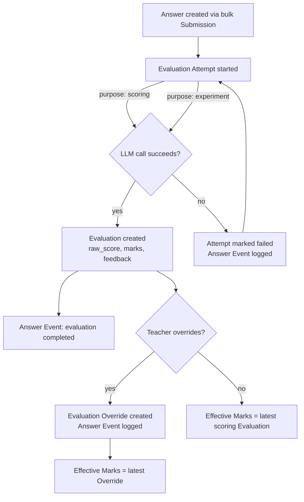

# Grading domain — model and design history

This document narrates how the grading domain's data model was arrived at, and captures the final shape as of 2026-08-23. Terminology below follows [`CONTEXT.md`](../CONTEXT.md); the specific trade-offs recorded here as deliberate deferrals or notable decisions are formalized in [`docs/adr/`](./adr/).

## Starting point

The only existing domain was `User` (auth), with no classes, students, subjects, exams, questions, or evaluation pipeline. A [sample benchmark dataset](../sample-dataset/) already existed as flat JSON per subject — question catalogues with types (`mcq`, `true_false`, `numeric`, `fill_in`, `open_response`), and generated student responses with `gold_label` ground truth — useful as a shape reference, but not itself a schema to mirror (it has no class/exam structure).

## How the shape was decided

The model was built top-down through a design-tree discussion, settling one layer before opening the next:

1. **Ownership and scope, kept deliberately minimal.** Classes have a single owner; students are scoped to one class with no cross-class identity. Both were explicitly chosen over building an organization/roster-management layer, because the project's core is the evaluation pipeline, not classroom administration. See [ADR 0001](./adr/0001-single-owner-classes-no-organization.md) and [ADR 0002](./adr/0002-class-scoped-student-identity.md).

2. **Subjects as a global catalogue, not per-class.** Initially considered class-specific subjects, but a shared catalogue (Indian curriculum, fixed set, no electives) selected per class via a join table was chosen instead — it gives one place to hang future subject-specific processing (e.g. a math-specific pipeline step) rather than duplicating "Mathematics" per class.

3. **Exams as multi-subject, term-based events.** The initial framing considered a single-subject exam ("unit test" style), but the actual target is Indian term exams, which cover several subjects at once. `Exam Subject` was introduced as the join between an `Exam` and a `Subject`, and it's where `Question` catalogues actually live — each subject within a term exam has its own independent question set.

4. **Question configurability via a validated JSONB boundary.** Question types are configurable (options for MCQ, blank count for fill-in, etc.) and open to future types. Rather than one table per type, `Question` has a `type` discriminator, a `config JSONB` payload, and a `schema_version` for future config migrations — with the explicit requirement that all reads/writes of `config` go through one Go-side validating interface, never ad hoc access scattered through the codebase.

5. **A question bank was considered and rejected — for now.** Reuse of questions across exams would need a bank plus versioning (what happens to a reused question when its marks change on one exam but not another?). Rejected as unnecessary complexity unless AI-driven question generation arrives, which would actually motivate reuse. See [ADR 0003](./adr/0003-no-reusable-question-bank.md).

6. **Submissions as the unit of bulk answer entry.** Rather than one-off `Answer` rows with no grouping, `Submission` (one per student × exam subject) was introduced specifically because the initial UI is teacher-driven bulk upload, not student self-serve entry — submissions are the natural unit of "has this student's paper been fully graded."

7. **Scoring: normalized, not raw — and Maximum Marks vs. Marks kept distinct.** `Raw Score` is 0.00–1.00, independent of a question's `Maximum Marks` (the ceiling, fixed on the Question), with `Marks` (what a specific Answer actually earned) computed as `raw_score × maximum_marks`. Scale-invariant normalization was chosen over a coarser fixed integer scale, since it works identically whether a question is worth 2 or 20 marks. Keeping Maximum Marks and Marks as separate terms — rather than one overloaded "marks" — avoids ambiguity between "what could be earned" and "what was earned" once Evaluation Overrides enter the picture.

8. **Rubric-based partial credit was raised and explicitly deferred.** A real scenario surfaced this: a math answer where the formula is correctly labeled (worth some marks), units are present or absent (worth a partial mark), and the final numeric answer is separately right or wrong. A single holistic score can't represent that. Rather than design a rubric-authoring system now, `Evaluation.breakdown` (JSONB, nullable) is reserved unused, so the eventual per-criterion structure — scaled to the question's Maximum Marks rather than 0–1, once the grading prompt carries that context — doesn't require a breaking migration. See [ADR 0005](./adr/0005-holistic-scoring-not-rubric-based.md).

9. **Evaluation history needed real structure, not just a status field.** What began as "track processing state" was pulled apart into four distinct concerns once a real requirement emerged (comparing models/pipeline versions as an analysis showcase, with results meant to feed an external CLI-generated report — not a Flutter UI):
   - `Evaluation Attempt` — one try, with a `status` and an `error`, and critically a `Purpose` (`scoring` vs `experiment`) so comparison runs can accumulate without ever being mistaken for the grade that counts. See [ADR 0007](./adr/0007-evaluation-attempt-purpose-flag.md).
   - `Evaluation` — 1:1 with a successful attempt; never mutated.
   - `Evaluation Override` — a teacher's manual correction, recorded alongside the Evaluation it corrects rather than replacing it, so both remain visible.
   - `Answer Event` — a flat, append-only audit log, chosen over reconstructing history by joining the three tables above, because a dedicated log was judged simpler to implement and reason about than a joins-only reconstruction.

10. **Batching as an infrastructure concern, not a business one.** `Evaluation Batch` groups Answers for cost-efficient LLM calls, but is explicitly decoupled from the Exam/Submission structure — it exists even for single-item background re-evaluation, and its sizing is a processing-pipeline concern that shouldn't leak into the academic schema.

11. **PII boundary and Bifrost.** Student name and Roll Number never leave the database. Every LLM-proxy-facing request carries an opaque `Correlation ID` minted locally instead — never the Roll Number, which is treated as indirectly identifying (often sequential per class). Named "Correlation ID" rather than "Trace ID" specifically to avoid colliding with this project's existing OpenTelemetry trace/span vocabulary — the two are unrelated identifier spaces. This Correlation ID does double duty as the pipeline correlation key, addressing the fact that Bifrost (the LLM proxy) can't correlate multiple requests within one pipeline on its own. A minimal local `LLM Call` log (tokens, latency, model) was added as a resilience backup against possible data loss on Bifrost's side — explicitly not a replacement for Bifrost's own token/cost tracking. See [ADR 0006](./adr/0006-opaque-id-pii-boundary-not-bifrost-config.md).

## Entity-relationship diagram

```mermaid
erDiagram
    USER ||--o{ CLASS : owns
    CLASS ||--o{ STUDENT : contains
    CLASS ||--o{ CLASS_SUBJECT : selects
    SUBJECT ||--o{ CLASS_SUBJECT : "offered via"
    CLASS ||--o{ EXAM : schedules
    EXAM ||--o{ EXAM_SUBJECT : covers
    SUBJECT ||--o{ EXAM_SUBJECT : "appears in"
    EXAM_SUBJECT ||--o{ QUESTION : catalogues
    STUDENT ||--o{ SUBMISSION : submits
    EXAM_SUBJECT ||--o{ SUBMISSION : "answered for"
    SUBMISSION ||--o{ ANSWER : contains
    QUESTION ||--o{ ANSWER : "answered by"
    ANSWER ||--o{ EVALUATION_ATTEMPT : "graded via"
    EVALUATION_ATTEMPT ||--o| EVALUATION : produces
    EVALUATION_ATTEMPT ||--o{ LLM_CALL : logs
    ANSWER ||--o{ EVALUATION_OVERRIDE : "corrected by"
    ANSWER ||--o{ ANSWER_EVENT : "history of"
    EVALUATION_BATCH ||--o{ EVALUATION_ATTEMPT : groups

    USER {
        uuid id PK
        string email
        string name
    }
    CLASS {
        uuid id PK
        uuid created_by FK
        string name
    }
    STUDENT {
        uuid id PK
        uuid class_id FK
        string name
        string roll_number
    }
    SUBJECT {
        uuid id PK
        string name
    }
    CLASS_SUBJECT {
        uuid class_id FK
        uuid subject_id FK
    }
    EXAM {
        uuid id PK
        uuid class_id FK
        string label
    }
    EXAM_SUBJECT {
        uuid id PK
        uuid exam_id FK
        uuid subject_id FK
    }
    QUESTION {
        uuid id PK
        uuid exam_subject_id FK
        string type
        jsonb config
        int schema_version
        numeric maximum_marks
    }
    SUBMISSION {
        uuid id PK
        uuid student_id FK
        uuid exam_subject_id FK
    }
    ANSWER {
        uuid id PK
        uuid submission_id FK
        uuid question_id FK
        text answer_text
    }
    EVALUATION_BATCH {
        uuid id PK
        string status
        string provider_batch_id
    }
    EVALUATION_ATTEMPT {
        uuid id PK
        uuid answer_id FK
        uuid batch_id FK
        string status
        string purpose
        string error
    }
    EVALUATION {
        uuid id PK
        uuid attempt_id FK
        numeric raw_score
        numeric marks
        text feedback
        jsonb breakdown
    }
    EVALUATION_OVERRIDE {
        uuid id PK
        uuid answer_id FK
        numeric marks
        text feedback
        string reason
        uuid overridden_by FK
    }
    ANSWER_EVENT {
        uuid id PK
        uuid answer_id FK
        string event_type
        jsonb payload
        string actor
    }
    LLM_CALL {
        uuid id PK
        uuid evaluation_attempt_id FK
        uuid correlation_id
        string model
        int tokens_in
        int tokens_out
        int cached_tokens
        int thinking_tokens
        int latency_ms
    }
```

## Evaluation lifecycle for one Answer



## Feedback — added after the initial model was confirmed

The first pass through the design tree settled scoring (Raw Score, Marks, Effective Marks) but missed something the user's original brief actually asked for: targeted, student-facing explanation of *why* an Answer earned what it did — not just a number. This surfaced once question-type scaling raised "does MCQ even need a scalable mark," which led to "does MCQ even need the LLM," which led to the real point: feedback quality (not just score accuracy) is a core showcase goal of this project, including comparing feedback across models/pipeline versions via `experiment`-Purpose Evaluation Attempts.

Resolved as a small, additive extension to the confirmed model rather than a redesign:

- `Evaluation.feedback` (text, nullable) — produced by the same LLM call that produces `raw_score`, for every Question Type including objective ones like MCQ. Present now, but option-specific misconception feedback ("you likely confused X with Y") is explicitly not in scope yet.
- `Evaluation Override.feedback` (text, nullable) — a teacher can supply their own Feedback alongside overridden Marks, resolved via the same override-else-latest-`scoring`-Evaluation rule as Effective Marks. In the UI this field is pre-filled with the AI's Feedback for the teacher to edit, not entered blank.
- No separate "Effective Feedback" term was minted in `CONTEXT.md` — the resolution rule is documented inline on the **Feedback** glossary entry instead, since a whole extra term for the same override-else-latest pattern felt like more formalism than the concept needs.
- `experiment`-Purpose Feedback is never surfaced to students/teachers, same as `experiment`-Purpose Marks never becoming Effective Marks — but it matters for the project's actual goal, since comparing feedback quality (not just score accuracy) across models/pipeline versions is expected to be a real output of the eventual CLI-based comparison tooling, not just internal to this codebase.

This also reopened a routing question — should MCQ/true_false/numeric grading skip the LLM (deterministic Go scoring) since there's a fixed correct answer? The user's answer: not yet, but it's a deliberate future axis ("brute-force vs. optimized" is itself something the project wants to demonstrate), not a decision to make now. See [ADR 0008](./adr/0008-uniform-llm-grading-deferred-optimization.md).

## Deliberately out of scope for v1

See the corresponding ADRs for the reasoning and revisit triggers:

- Multi-teacher / organization support ([ADR 0001](./adr/0001-single-owner-classes-no-organization.md))
- Cross-class / cross-year student identity ([ADR 0002](./adr/0002-class-scoped-student-identity.md))
- Reusable question bank ([ADR 0003](./adr/0003-no-reusable-question-bank.md))
- Question pre-processing model ([ADR 0004](./adr/0004-no-question-preprocessing-model.md))
- Rubric-based step-wise partial credit ([ADR 0005](./adr/0005-holistic-scoring-not-rubric-based.md))
- Deterministic (non-LLM) grading path for objective Question Types ([ADR 0008](./adr/0008-uniform-llm-grading-deferred-optimization.md))
